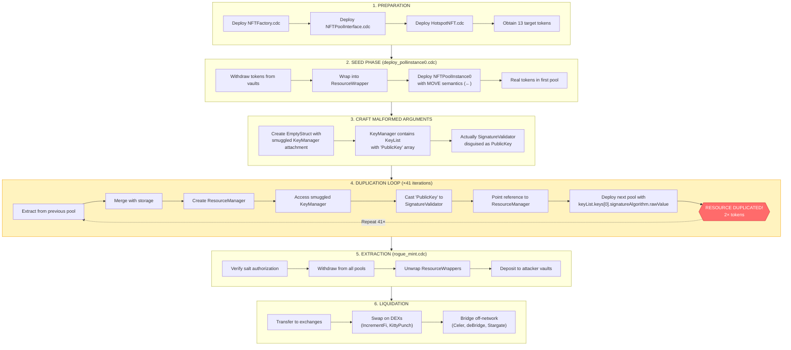
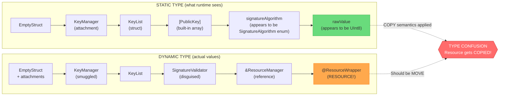
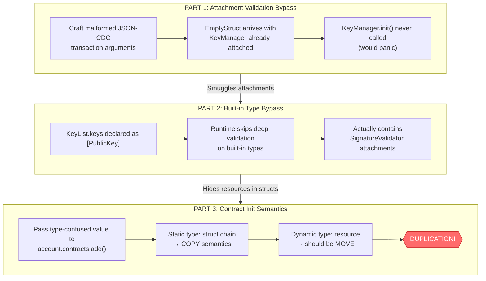
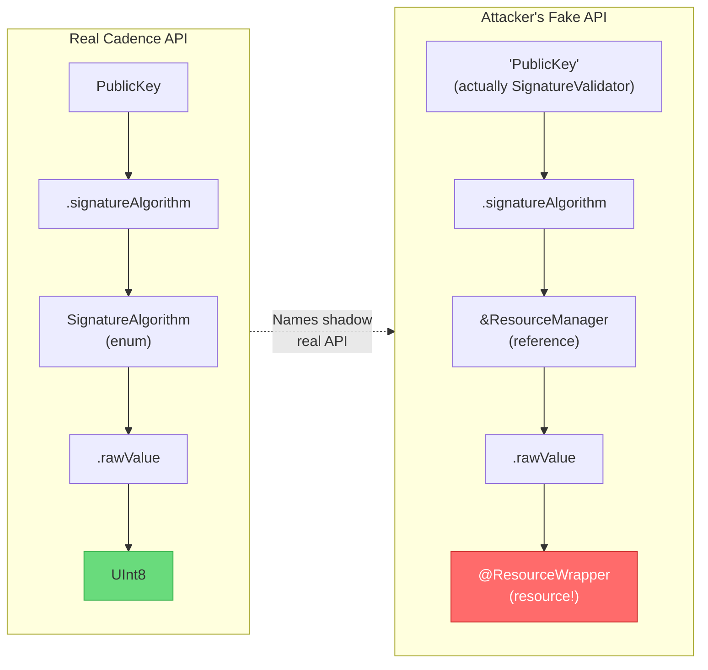
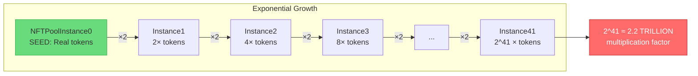
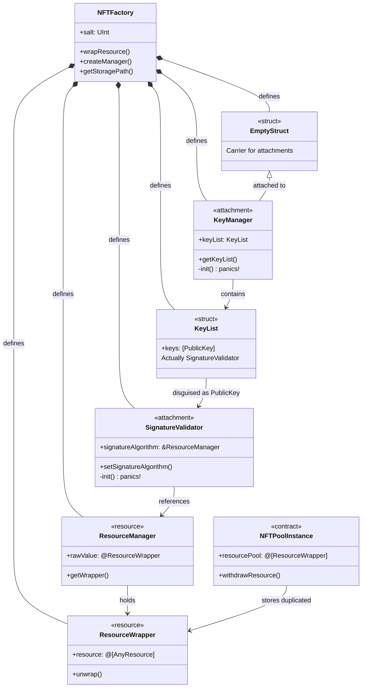

# Flow Network Attack - Mermaid Diagrams

Visual representations of the December 27, 2025 Type Confusion Attack.

## Complete Attack Flow



## Type Confusion Chain



## Three-Part Exploit Chain



## API Shadowing Obfuscation



## Duplication Mathematics



## Attack Timeline

```mermaid
timeline
    title December 27, 2025 Attack Timeline (PST)
    
    section Dec 26
        23:25 : Attack contracts deployed
              : Block 137363398
        23:35 : Token duplication begins
              : ~41 iterations
        23:36 : Transfers to secondary accounts
        23:42 : First deposits to exchanges

    section Dec 27
        00:06 : Assets bridged off-network
              : Celer, deBridge, Stargate
        01:00 : Exchange sell pressure detected
        01:30 : Anomaly detection triggered
        05:21 : Final attacker transfer
        05:23 : Network HALTED
              : Block 137390190

    section Dec 29
        05:00 : Network restored
              : Read/write access
```

## Contract Relationships



---

_Diagrams created January 2026_
