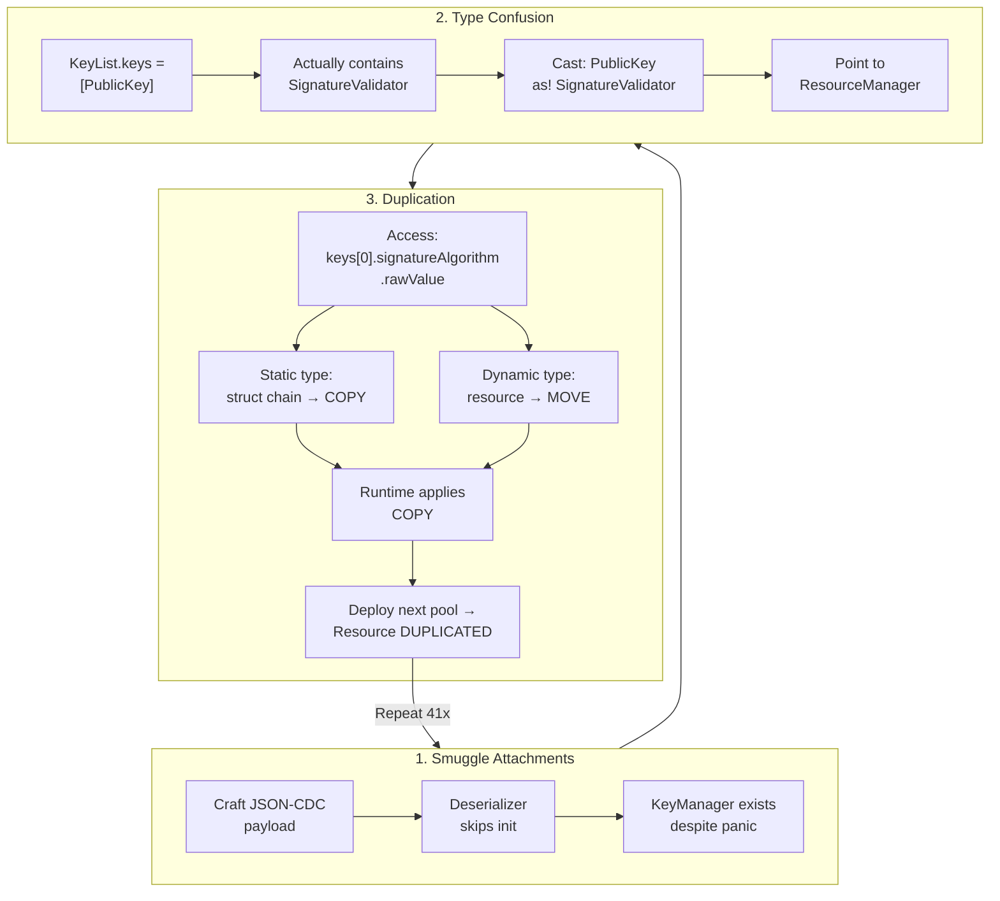

```mermaid
flowchart TB
    subgraph SMUGGLE ["1. Smuggle Attachments"]
        A[Craft JSON-CDC<br/>payload] --> B[Deserializer<br/>skips init]
        B --> C[KeyManager exists<br/>despite panic]
    end

    subgraph CONFUSE ["2. Type Confusion"]
        D["KeyList.keys =<br/>[PublicKey]"] --> E[Actually contains<br/>SignatureValidator]
        E --> F["Cast: PublicKey<br/>as! SignatureValidator"]
        F --> G[Point to<br/>ResourceManager]
    end

    subgraph DUPLICATE ["3. Duplication"]
        H["Access:<br/>keys[0].signatureAlgorithm<br/>.rawValue"]
        H --> I["Static type:<br/>struct chain → COPY"]
        H --> J["Dynamic type:<br/>resource → MOVE"]
        I --> K[Runtime applies<br/>COPY]
        J --> K
        K --> L["Deploy next pool →<br/>Resource DUPLICATED"]
    end

    SMUGGLE --> CONFUSE --> DUPLICATE
    L -->|"Repeat 41x"| SMUGGLE
```
