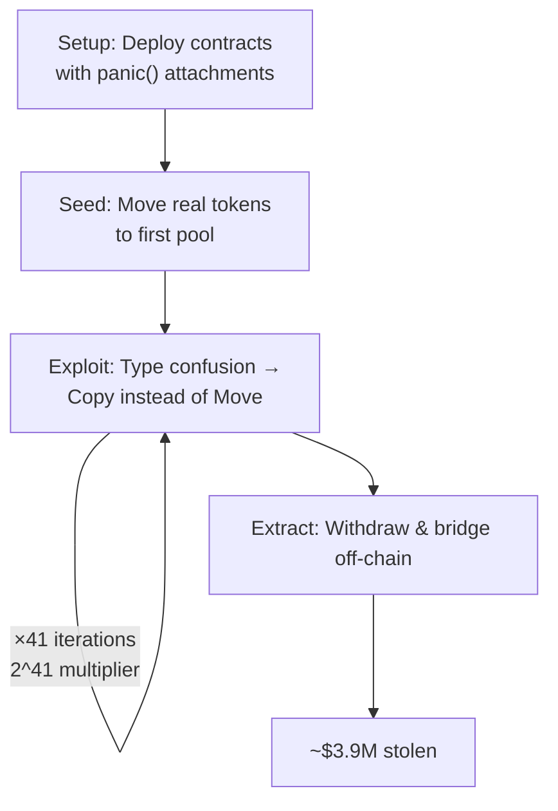

```mermaid
flowchart TB
    SETUP["Setup: Deploy contracts<br/> with panic() attachments"]
    SEED["Seed: Move real tokens<br/> to first pool"]
    EXPLOIT["Exploit: Type confusion → <br/>Copy instead of Move"]
    EXTRACT["Extract: Withdraw & bridge off-chain"]

    SETUP --> SEED
    SEED --> EXPLOIT
    EXPLOIT -->|"×41 iterations<br/>2^41 multiplier"| EXPLOIT
    EXPLOIT --> EXTRACT
    EXTRACT --> PROFIT["~$3.9M stolen"]
```
