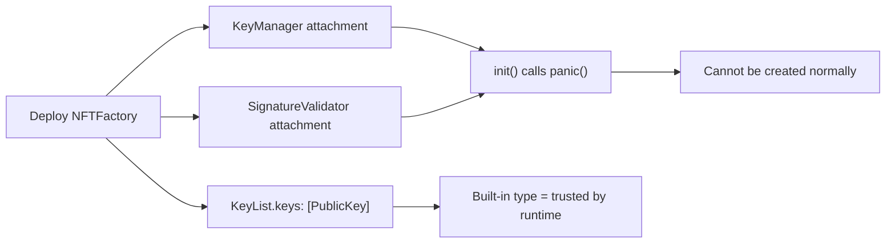

```mermaid
flowchart LR
    A[Deploy NFTFactory] --> B[KeyManager attachment]
    A --> C[SignatureValidator attachment]
    B --> D["init() calls panic()"]
    C --> D
    D --> E[Cannot be created normally]

    A --> F["KeyList.keys: [PublicKey]"]
    F --> G[Built-in type = trusted by runtime]
```
