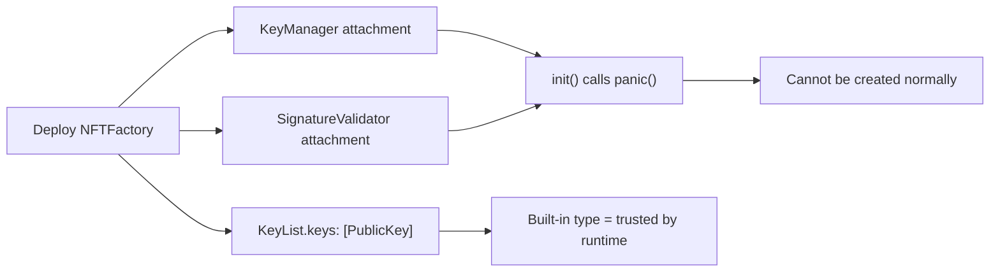
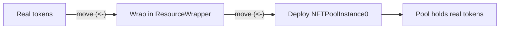
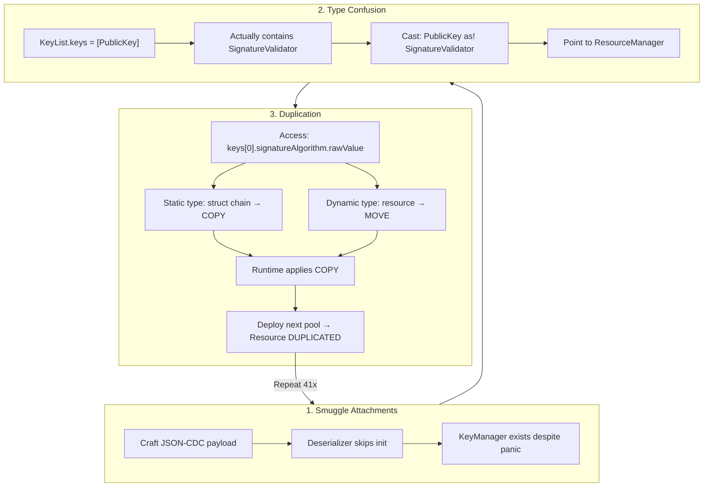
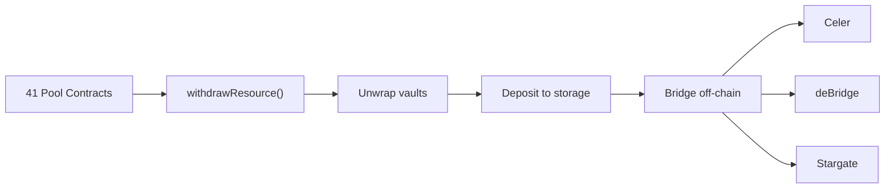
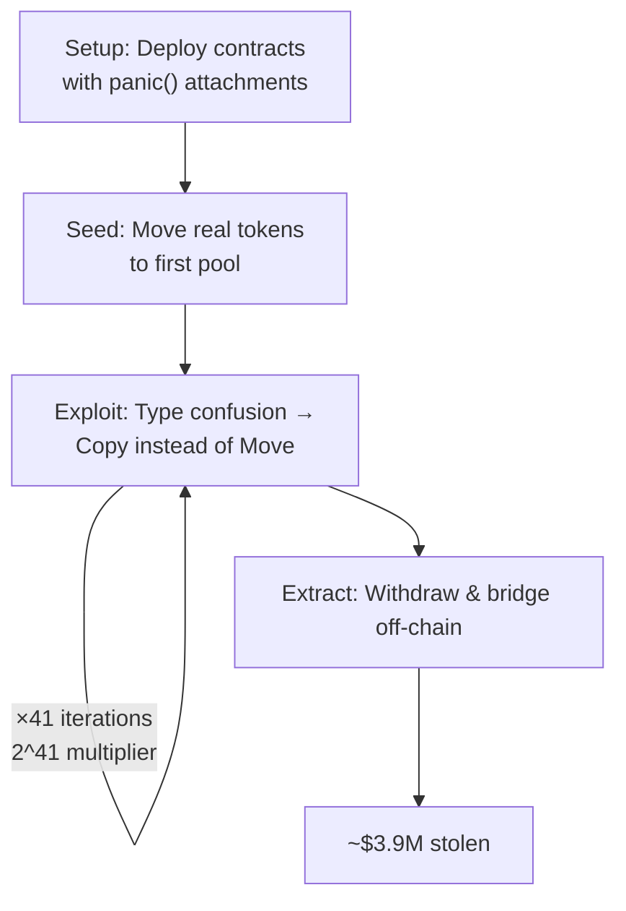
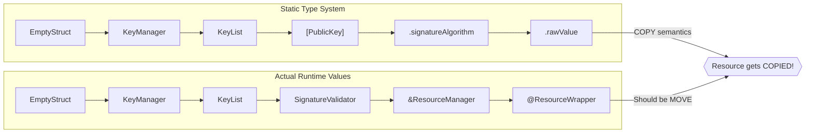

# Attack Flow Diagrams

## Setup Phase

```mermaid
flowchart LR
    A[Deploy NFTFactory] --> B[KeyManager attachment]
    A --> C[SignatureValidator attachment]
    B --> D["init() calls panic()"]
    C --> D
    D --> E[Cannot be created normally]

    A --> F["KeyList.keys: [PublicKey]"]
    F --> G[Built-in type = trusted by runtime]
```

## Seed Phase

```mermaid
flowchart LR
    A[Real tokens] -->|"move (<-)"| B[Wrap in ResourceWrapper]
    B -->|"move (<-)"| C[Deploy NFTPoolInstance0]
    C --> D[Pool holds real tokens]
```

## Exploit Phase

```mermaid
flowchart TB
    subgraph SMUGGLE ["1. Smuggle Attachments"]
        A[Craft JSON-CDC payload] --> B[Deserializer skips init]
        B --> C[KeyManager exists despite panic]
    end

    subgraph CONFUSE ["2. Type Confusion"]
        D["KeyList.keys = [PublicKey]"] --> E[Actually contains SignatureValidator]
        E --> F["Cast: PublicKey as! SignatureValidator"]
        F --> G[Point to ResourceManager]
    end

    subgraph DUPLICATE ["3. Duplication"]
        H["Access: keys[0].signatureAlgorithm.rawValue"]
        H --> I["Static type: struct chain → COPY"]
        H --> J["Dynamic type: resource → MOVE"]
        I --> K[Runtime applies COPY]
        J --> K
        K --> L["Deploy next pool → Resource DUPLICATED"]
    end

    SMUGGLE --> CONFUSE --> DUPLICATE
    L -->|"Repeat 41x"| SMUGGLE
```

## Extraction Phase

```mermaid
flowchart LR
    A[41 Pool Contracts] --> B["withdrawResource()"]
    B --> C[Unwrap vaults]
    C --> D[Deposit to storage]
    D --> E[Bridge off-chain]

    E --> F[Celer]
    E --> G[deBridge]
    E --> H[Stargate]
```

## Complete Flow (Overview)

```mermaid
flowchart TB
    SETUP["Setup: Deploy contracts<br/> with panic() attachments"]
    SEED["Seed: Move real tokens<br/> to first pool"]
    EXPLOIT["Exploit: Type confusion → <br/>Copy instead of Move"]
    EXTRACT["Extract: Withdraw & bridge off-chain"]

    SETUP --> SEED
    SEED --> EXPLOIT
    EXPLOIT -->|"×41 iterations<br/>2^41 multiplier"| EXPLOIT
    EXPLOIT --> EXTRACT
    EXTRACT --> PROFIT["~$3.9M stolen"]
```

## The Core Bug (Visual)

```mermaid
flowchart LR
    subgraph STATIC ["Static Type System"]
        S1[EmptyStruct] --> S2[KeyManager]
        S2 --> S3[KeyList]
        S3 --> S4["[PublicKey]"]
        S4 --> S5[".signatureAlgorithm"]
        S5 --> S6[".rawValue"]
    end

    subgraph DYNAMIC ["Actual Runtime Values"]
        D1[EmptyStruct] --> D2[KeyManager]
        D2 --> D3[KeyList]
        D3 --> D4[SignatureValidator]
        D4 --> D5["&ResourceManager"]
        D5 --> D6["@ResourceWrapper"]
    end

    S6 -->|"COPY semantics"| RESULT
    D6 -->|"Should be MOVE"| RESULT
    RESULT{{"Resource gets COPIED!"}}
```
